# Deque benchmark
Four types of elements are tested. They are described below. Both my and gcc deques are compiled with `Release` which uses O3 
optimization.

| element type     | size in bytes | description                                   | 
|------------------|---------------|-----------------------------------------------|
| `char`           | 1             | N/A                                           |
| `small_element`  | 8             | contains a single long                        |
| `medium_element` | 58            | contains a long and a char buffer of size 50  |
| `big_element`    | 508           | contains a long and a char buffer of size 500 |

## Constant read operations
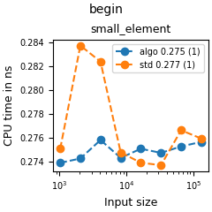
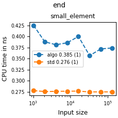
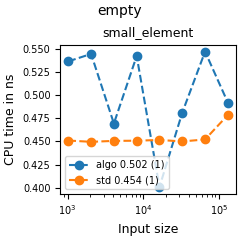
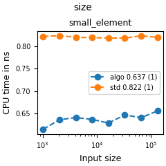

Since these read operations don't depend on the data type, only one data type is tested. My implementation performs similarly as gcc one.

## Iteration
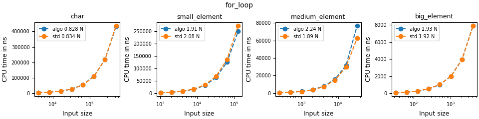

The test above involves using index and `size()` in the loop guard to loop over the content of a deque. My implementation performs similarly as gcc one.

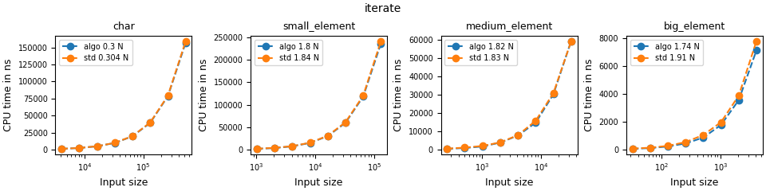

The test above creates a for each loop with `auto&`. My implementation is equally fast as the gcc deque. When iterating over a deque of `big_element`s, 
mine is slightly faster potentially due to the fact that the minimum number of elements in each chunk is 4 in my implementation whereas there is no 
such threshold for gcc implementation. This may reduce some pointer arithmetic and therefore provide some performance boost.

## Sort
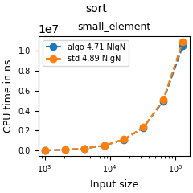

This test creates deques of various lengths and times the time to sort them by calling `std::sort` with range `begin()` and `end()`. Mine and gcc deque perform equally.

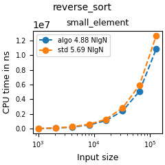

This test creates deques of various lengths and times the time to sort them by calling `std::sort` with range `rbegin()` and `rend()`. Mine performs better than gcc since gcc uses 
`std::reverse_iterator` and this adds a layer of redirection and thus some redundant computation. Mine is a direct class wich every member function explicitly implemented. Code redundancy
is eliminated by sharing the same class as the regular iterator and using `constexpr if` for operations with distinct implementations.

## Push/Pop
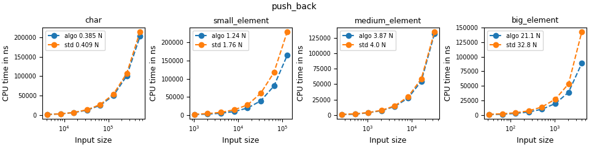
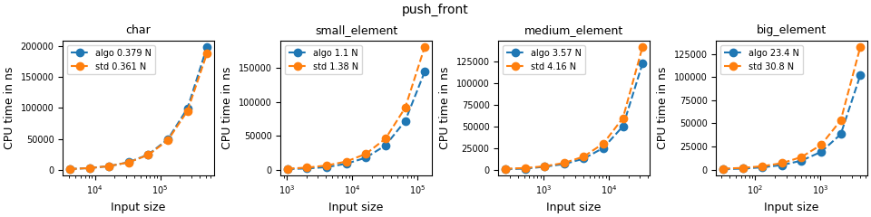

Pushing at both ends are  faster than the gcc implementation in all benchmarks except for the `push_front char` one. 
This is due to an additional rearrangement implementation. Both my implementation and gcc one used chunk based map. When we 
try to add on one end but there is no more room, gcc implementation tries to center all elements by shifting them to the center. 
Moving is not cheap unless the value type implements a fast move constructor/assignment operator. My implementation rearranges 
chunks by borrowing unused chunks from the opposite end. This only involves moving pointers and are therefore always fast. The 
downside is that the first and last allocated chunks may have some unused space. This is constant amount of memory wasted 
(one chunk at most) and I believe it is justified.

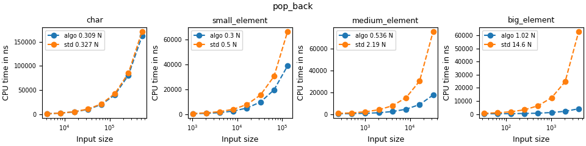
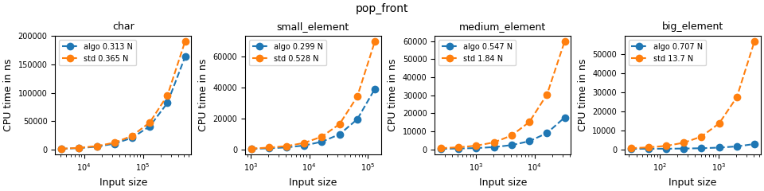

Popping from both ends are faster than gcc. Better general performance is attributed to the fact that
gcc deque frees chunks if they become unused. This is a tradeoff I made since people can always call `shrink_to_fit` if memory becomes a bottleneck.
Not needing to check and free chunks provides significant performance gain, and I think it justifies the extra memory allocation.

TODO: allow the user to tune the behavior by adding an additional overload that frees the chunks.

## Shift
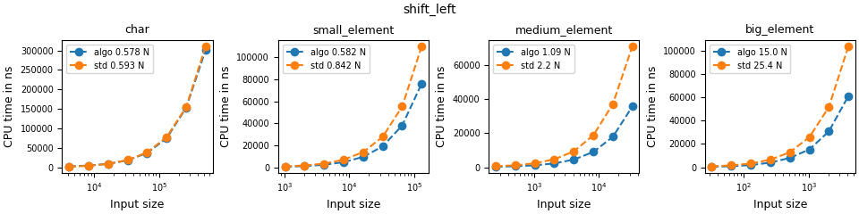
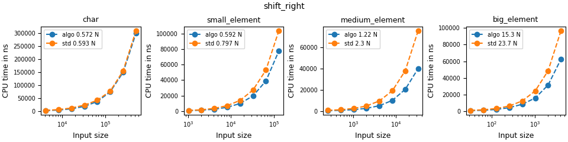

These benchmarks include repeatedly pushing an element from one end and popping from the other end, essentially shifting a single 
element to one direction. These unique test cases are included since they measure how well both deques are able to handle small 
amount of data in edge cases. A naive implementation would allocate new chunks instead of reusing existing space. Gcc implementation 
shift all elements by calling moving them, but mine moves the chunks. The former is for small data like chars since moving a single 
char is fast. However, moving bigger data type starts to suffer from the wrong assumption that moving is fast. Moving chunks are 
just moving pointers, and they are safer when the move constructor can throw, or there is no move constructor available.

## Insert
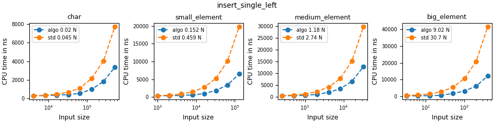
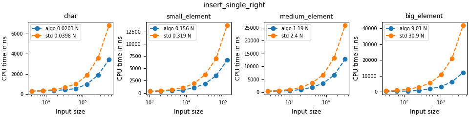

These benchmarks tests insertion of a single element at position N/3 and 2N/3, where N is the length of deque. This particular 
configurations are included since standard requires the complexity of inserts to be linear to the distance to the closer end of 
the deque. Gcc implements this by using push operations and moving entire range from the closer end to the insertion position. This 
implementation satisfies the requirement, but the amortized full range move hidden in the push operations make insertions slower 
compared to rearranging free chunks directly.

## Erase
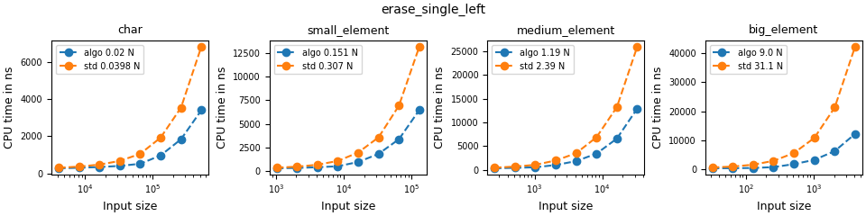
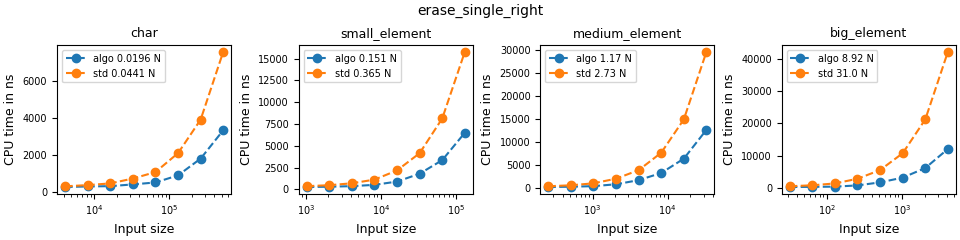

Like insertion benchmarks, these benchmarks test erasure of a single element at position N/3 and 2N/3, where N is the 
length of deque. This configurations are included since standard requires the complexity of insertions to be linear to 
the distance to the closer end of the deque. The high-level implementation in mine and gcc is similar. We both move 
elements to fill the hole caused by the erasure. Mine shows higher performance for trivially move or copy assignable 
types since a special algorithm backed by `std::memmove` is used. This is justified since trivial assignable 
types can be copied by directly copying the byte content. All primitives, aggregate types of them like int arrays or pairs enjoy this optimization.
