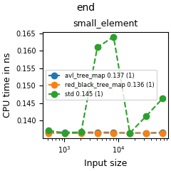
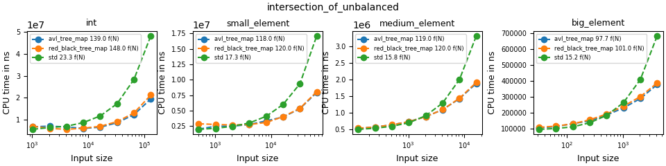

# Deque benchmark
Four types of elements are tested. They are described below. Both my and gcc maps are compiled with `Release` which uses O3 optimization.
Due to the unpredictable nature of tree data structures, I defined 18 (a random number I picked) different orders to insert the same key value pairs.
This eliminates the advantage of certain implementation seen in a particular favorable insertion order. I used a small strings for all keys, and
the values are of the following types.

| element type     | size in bytes | description                                   | 
|------------------|---------------|-----------------------------------------------|
| `int`            | 8             | N/A                                           |
| `small_element`  | 8             | contains a single long                        |
| `medium_element` | 58            | contains a long and a char buffer of size 50  |
| `big_element`    | 508           | contains a long and a char buffer of size 500 |

## Constant read operations

These constant operations are tested by creating maps of different sizes and measure their performance through repeated invocations. 
My `begin()` is faster because `gcc` involves a few more pointer accesses which manifest as an extra `mov` execution when there is a scarcity
of registers. Similar explanation can be offered for the `empty()` performance difference.

## Iteration

This benchmark uses a for loop to accumuate all values in the map. Gcc map outperforms my implementation slightly.

## Lookup operations

All three methods are tested by mixing 50% of missing keys with 50% of present keys to simulate realistic use case. All three
implementations have similar performance.

## Insertion

Inserting new/existing elements have great performance difference since inserting new elements require memory allocation and rebalance.
I benchmarked both cases separately for maximum clarity. For the successful insertion benchmark, the map is initially empty and the
time to insert all values is measured. For the benchmark of inserting existing elements, the map is initialized with all values, and
the time to attempt to insert them is measured.

Both my avl and red black trees outperform gcc red black tree slightly when insertions are successful, but they are outperformed when
we insert existing keys. It is unclear when my implementations are slower to find insertion parent.

One interesting finding is present/absent bigo coefficients only differ by a fraction, and the fraction is greater when the 
element type is greater. This suggests that rebalancing takes less time than the downward pass to find the insertion parent 
since it is dominated by memory allocation.

Another common insertion method is insertion with hint. This is useful when the keys to insert are already ordered, so we can give
a hint to the data structure about where the insertion position may be. There are two symmetric cases, one with the hint smaller
than the insertion position, and the other with the hint greater. In either cases, my implementations outperform gcc map by a big margin.

## Erasure

Like insertion, erasing absent/present keys have great performance difference since erasing present keys require memory deallocation and rebalance.
I benchmarked both cases separately for maximum clarity. For the successful erasure benchmark, the map is initialized and the time
to erase them all is measured. For the benchmark of erasing absent keys, the map is also initialized, but we only attempt to erase keys that
don't exist. Therefore the map size remains constant in the entire benchmark

In either cases, my implementations outperform gcc map or perform equally well.

## Bulk operations
My map operations additionally support join-based bulk operations which have a better time complexity than naive bulk operations. They 
can also be parallelized to further boost performance. Given two maps of sizes `N` and `M` where `N <= M`, the time complexity for taking
the union of them is `O(Nlog(M/N + 1))`. This becomes `O(N)` when `N = M`, and `O(logM)` when `N = 1`. Since there are two variables in
the bigo notation, I performed two different benchmarks to observe the performance change along two dimensions. I first tested the case
when `N = M` and I scaled their value by a factor of 2. Then I tested the case when `M` stays at a big value, 2^17, and I scaled `N`
by a factor of 2. This same methodology is used for the other two bulk operations. To make a realistic example, I initialized the two maps
such that each key in a map has 1/2 chance to also appear in the other map.

To better showcase the superiority of join-based implementations, I also implemented the naive union, i.e. inserting all values in the smaller
map into the bigger one, to serve as a comparison.

Clearly the join based union scales better despite having a greater coefficient.

Like union, I also implemented naive intersection for gcc map by removing elements absent in the bigger map in the smaller map. An interesting
observation is while the thereotical time complexity for join-based intersection is `O(Nlog(M/N + 1))`, the actual time complexity 
is dominated by memory deallocation, especially when the intersection of two maps are small compared to the original sizes.

Like union, I also implemented naive difference for gcc map by removing all elements in one map from the other map.
