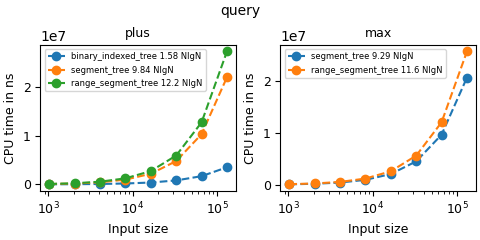
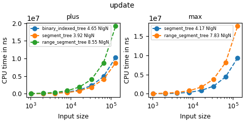
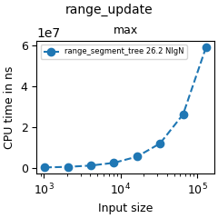
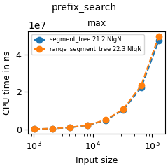
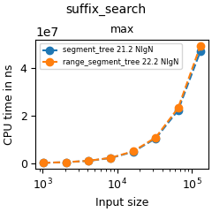

# Range query benchmark
Binary indexed tree, segment tree and range segment tree are three common range query data structures with increasing complexity 
and ability. The most common use case is to for fast range sum/min/max with fast updates. Binary indexed tree is the most compact
and least powerful among them due to the need for inverse operation (like minus for plus). Segment tree waives the requirement of
an inverse operation, but it doubles the memory consumption and requires recursion in the most obvious implementation. Range
segment tree further supports range updates at the cost of a slower for single update/range query. All operations are `O(logn)`, but
their coefficients differ wildly.

## Query

I instantiate all three trees with `std::plus<int>` and segment tree/range segment tree with `std::max<int>`. I randomly created a list of queries by choosing pairs of random first and last indices. The query creation is outside of benchmark. Binary indexed tree is much
faster due to the iterative implementation. Segment tree is faster than range segment tree since range segment tree has to lazily propagate
changes staged by range update. This causes branching and potential slow down. 

**TODO: use iterative implementation for both segment tree and range segment tree and examine performance differences**

## Single update

I instantiate all three trees with `std::plus<int>` and segment tree/range segment tree with `std::max<int>`. I randomly created a 
list of update arguments by choosing random indices to update. Binary indexed tree is slower despite of its iterative 
implementation. This is potentially due to the fact that many arithmetic operations are used to manipuate binary indexed tree indices.
**TODO: use iterative implementation for both segment tree and range segment tree and examine performance differences**

## Range update

As expected, range update is much slower than regular update due to the additional lazy propagation.

## Prefix/suffix search

These are non-standard functionalities of segment trees. Given a range, these functions can find the leftmost or the rightmost 
position in the range such that the prefix or the suffix of this range that ends at this position satisfies a decider. For example, 
if the tree is a max tree of length 10, we can specify the range to be [2, 6) If we want to find the leftmost element that is at
least > N (for some number N), we can call `prefix_search({ return num > N; }, 2, 6)`. These functionalities are
exposed since otherwise the users have to do binary search and the time complexity will be `O(log^2n)`
