# Vector benchmark
Four types of elements are tested. They are described below. Both mine and gcc vectors are compiled with `Release` which uses O3 
optimization. Vector is a straightforward data structure, so there isn't room for different implementation. My implementation performs 
equally as gcc one in most benchmarks.

| element type     | size in bytes | description                                   | 
|------------|-------------|-------------|
| `char`           | 1             | N/A                                           |
| `small_element`  | 8             | contains a single long                        |
| `medium_element` | 58            | contains a long and a char buffer of size 50  |
| `big_element`    | 508           | contains a long and a char buffer of size 500 |

## Constant read operations
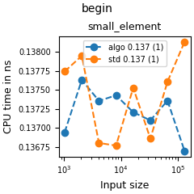
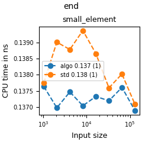
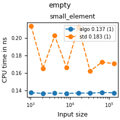
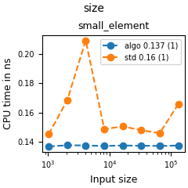

My implementation performs equally as gcc one for `begin()` and `end()`. `size()` is faster because
I explicitly store it, but gcc vector has to compute it by performing pointer arithmetic between the stored begin and end iterators.

## Iteration
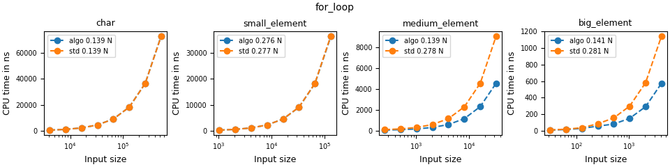

The test above involves using index and `size()` in the loop guard to loop over the content of a vector. My implementation performs equally as gcc one.

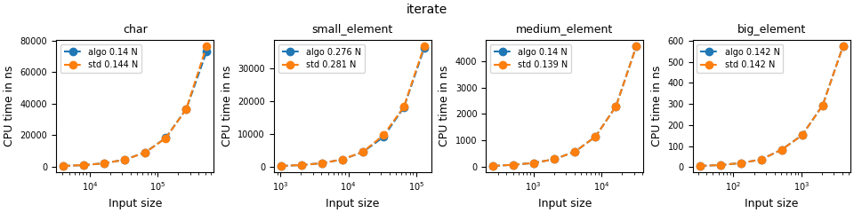

The test above creates a for each loop with `auto&`. My implementation performs equally as the gcc vector.

## Sort
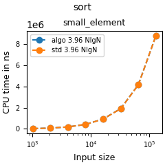

This test creates vectors of various lengths and times the time to sort them by calling `std::sort` with range `begin()` and `end()`. My and gcc vectors perform equally.

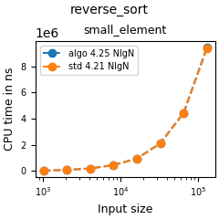

This test creates vectors of various lengths and times the time to sort them by calling `std::sort` with range `rbegin()` and `rend()`. My and gcc vectors perform equally.

## Push/Pop
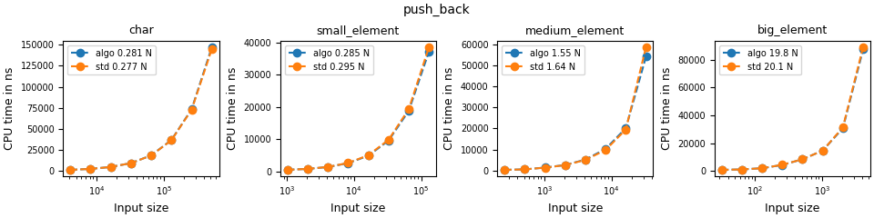
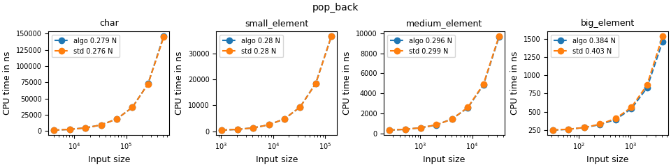

Both implementations perform equally.

## Insert/Erase
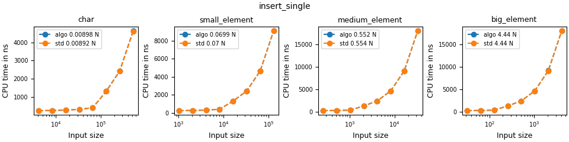
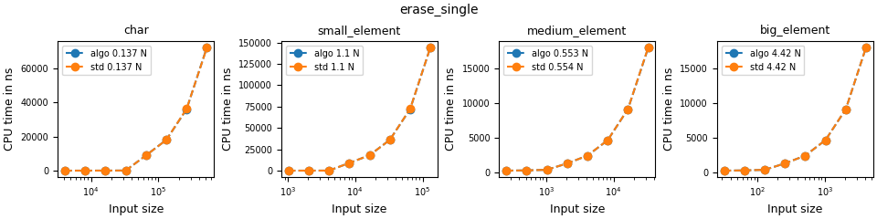

Both implementations perform equally.
